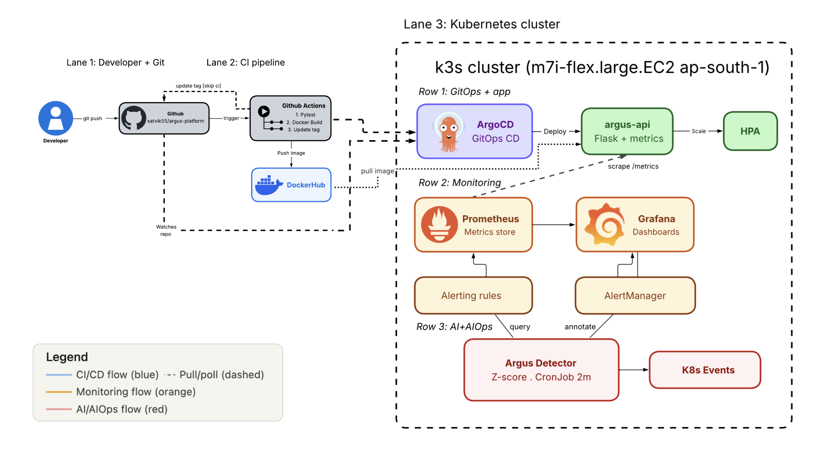
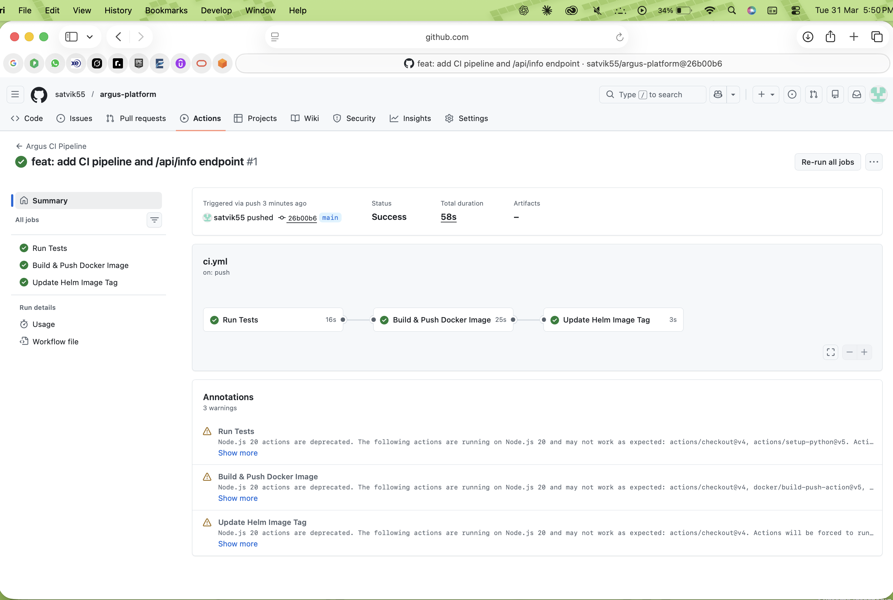
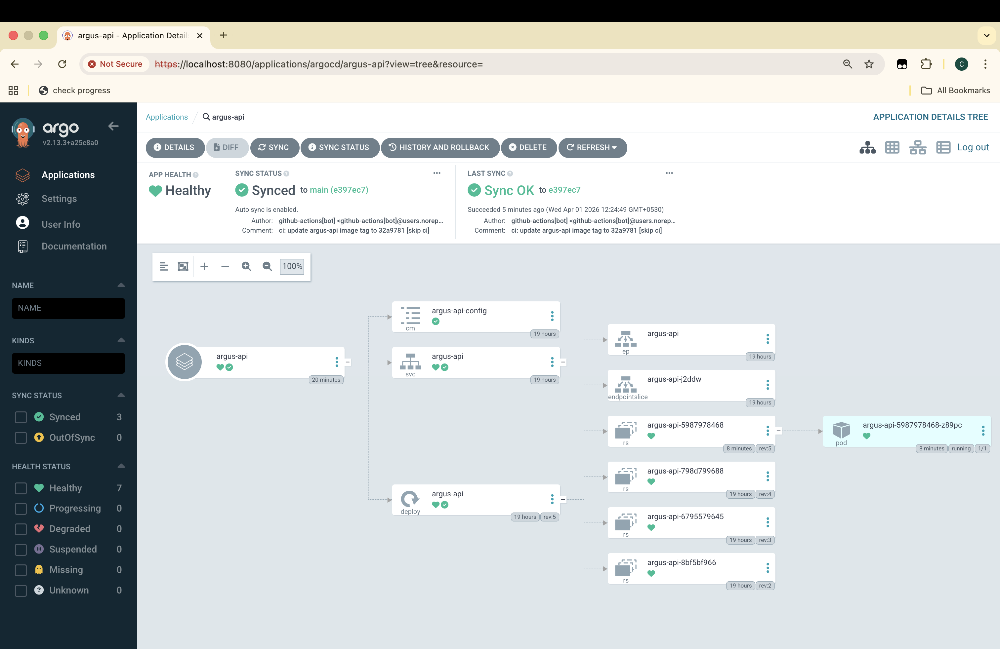
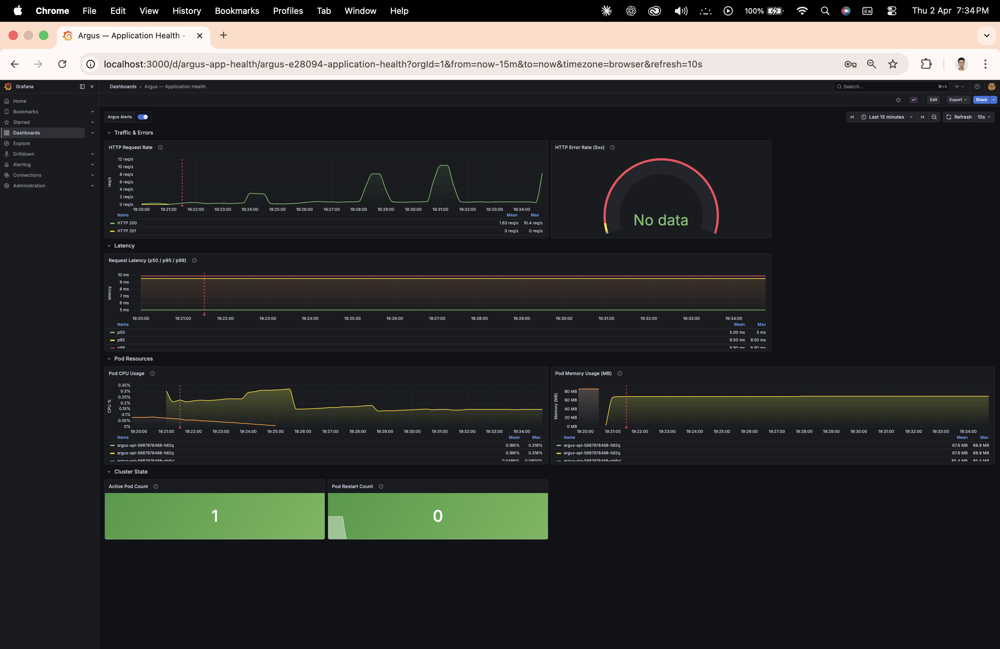
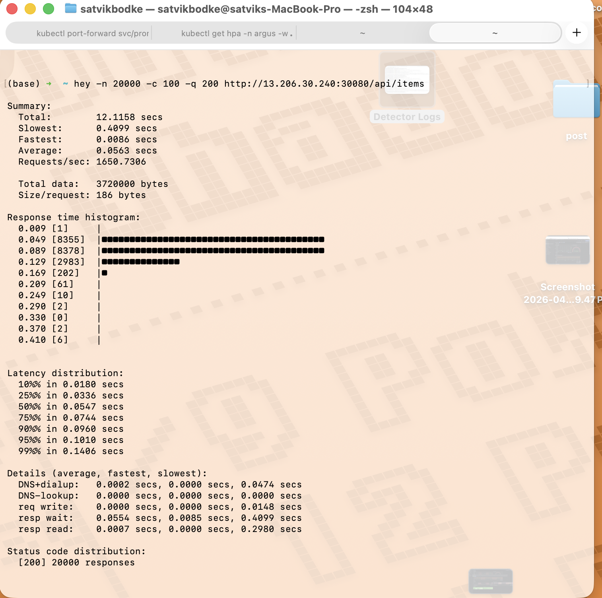
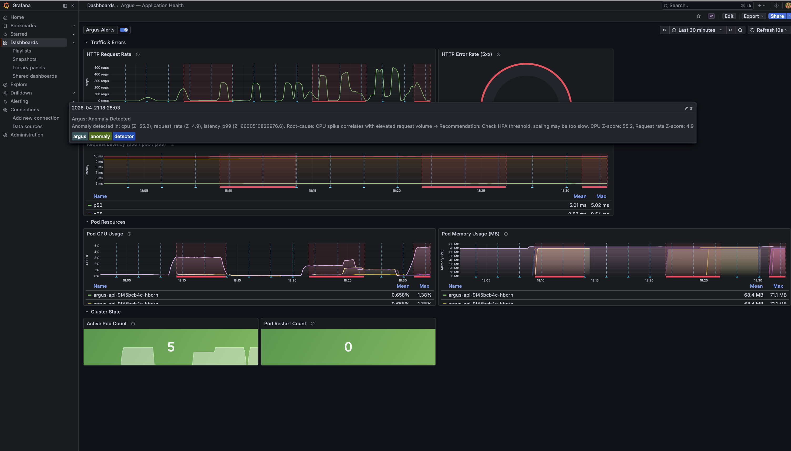
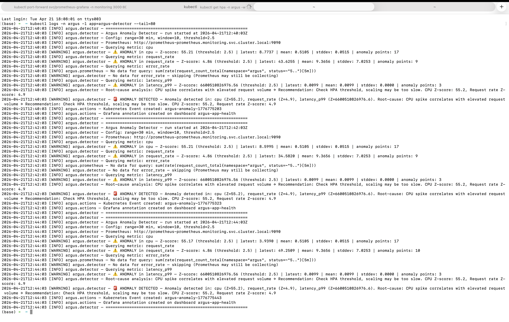
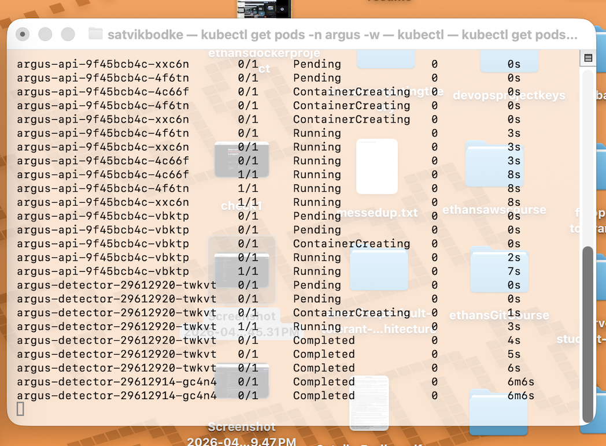
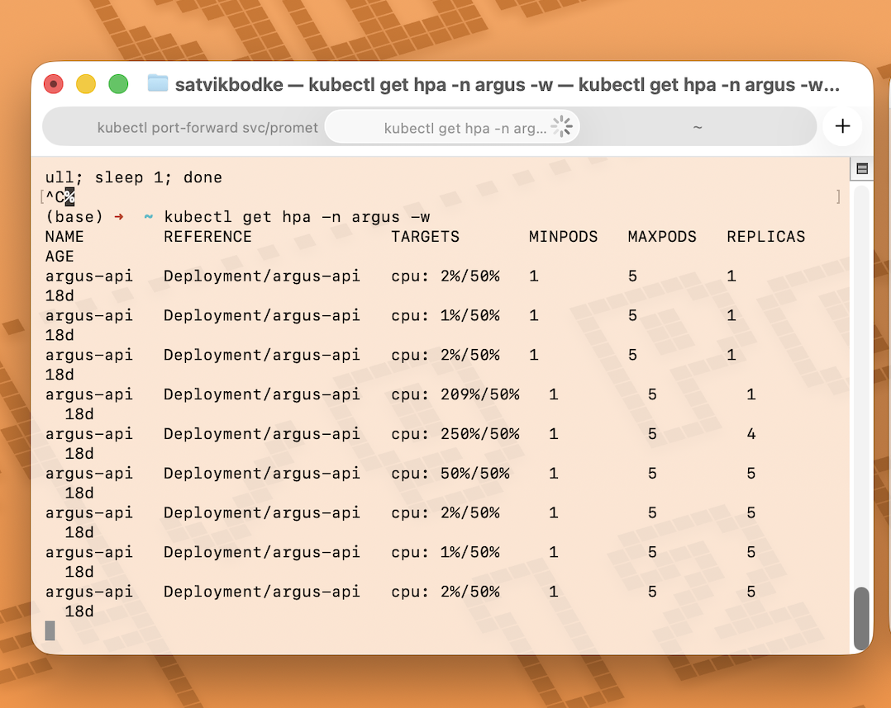

# Argus — Intelligent Kubernetes Observability Platform

A Kubernetes-native observability platform that combines **GitOps deployment** (ArgoCD), **full-stack monitoring** (Prometheus + Grafana), and **AI-powered anomaly detection** — all running on a single-node k3s cluster. Argus detects infrastructure anomalies before they become outages by correlating CPU, latency, error rate, and request volume using statistical analysis, and surfaces root-cause hints via Grafana annotations and Kubernetes Events.



---

## How It Works

```
Developer pushes code
    → GitHub Actions runs tests, builds Docker image, pushes to DockerHub
    → Updates Helm values.yaml with new image SHA
    → ArgoCD detects the change, auto-deploys to k3s cluster
    → Prometheus scrapes application metrics every 15 seconds
    → Anomaly Detector (CronJob) analyzes metrics with Z-score every 2 minutes
    → On anomaly: creates Kubernetes Event + Grafana annotation with root-cause hint
    → HPA auto-scales pods from 1→5 based on CPU utilization
```

No manual `kubectl` commands in the deploy loop. Git is the single source of truth — even manual cluster changes get reverted by ArgoCD's self-heal.

---

## Tech Stack

| Layer | Tool | Why This One |
|-------|------|-------------|
| Application | Python 3.11, Flask, prometheus_client | Lightweight API with native Prometheus metrics |
| Container | Docker (multi-stage build) | 130 MB image vs 450 MB single-stage |
| CI | GitHub Actions | Free for public repos, YAML-based (used Jenkins in a [previous project](https://github.com/satvik55/cicd-pipeline-project)) |
| CD / GitOps | ArgoCD | Built-in UI for demos, auto-sync + self-heal + auto-prune |
| Orchestration | k3s | Certified Kubernetes, $0 control plane (EKS = $73/month) |
| Packaging | Helm 3 | Templated deployments with values overrides and rollback |
| Monitoring | Prometheus (kube-prometheus-stack) | Industry standard, ServiceMonitor CRD for auto-discovery |
| Dashboards | Grafana | 7-panel custom dashboard with anomaly annotations |
| AI / AIOps | Custom Python (Z-score anomaly detection) | No training data needed, explainable, runs as a lightweight CronJob |
| Auto-scaling | HPA + metrics-server | CPU-based scaling 1→5 pods at 50% threshold |
| Load Testing | hey | HTTP load generation at 100 concurrent connections |
| Cloud | AWS EC2 (m7i-flex.large), Elastic IP | Single-node cluster, total project cost under $10 |

---

## CI/CD Pipeline

Every push to `main` triggers a 3-job pipeline:

1. **Test** — runs pytest (18 tests)
2. **Build & Push** — builds `linux/amd64` image, pushes to DockerHub with git SHA tag
3. **Update Helm Tag** — commits the new image SHA to `values.yaml` with `[skip ci]`



ArgoCD watches the repo and auto-syncs within 3 minutes of the tag update. No manual deployment step.



---

## Monitoring & Alerting

Prometheus scrapes the `/metrics` endpoint every 15 seconds via a ServiceMonitor. The custom Grafana dashboard tracks 7 metrics:

| Panel | What It Shows |
|-------|--------------|
| HTTP Request Rate | Requests/second by status code |
| HTTP Error Rate (5xx) | Percentage gauge with green/yellow/red thresholds |
| Request Latency (p50/p95/p99) | Percentile distribution — p99 catches worst-case UX |
| Pod CPU Usage | Per-pod CPU % — HPA scales at 50% |
| Pod Memory Usage | Working set in MB — catches leaks before OOM |
| Active Pod Count | Current running replicas (1→5 during scaling) |
| Pod Restart Count | Detects crash loops |

Four PrometheusRule alerts fire when thresholds are breached:

| Alert | Condition | Severity |
|-------|-----------|----------|
| ArgusHighCPU | CPU > 80% for 5 min | Warning |
| ArgusHighRestarts | > 3 restarts in 10 min | Critical |
| ArgusHighErrorRate | 5xx > 5% for 3 min | Critical |
| ArgusHighLatency | p99 > 2s for 5 min | Warning |

**Idle baseline (normal operation):**



**Under load (20,000 requests at 100 concurrent connections):**



---

## AI-Powered Anomaly Detection

The Argus Detector runs as a Kubernetes CronJob every 2 minutes. It queries Prometheus for the last 30 minutes of metrics, calculates rolling Z-scores (window = 10 data points, threshold = 2.5), and correlates anomalies across metrics to produce root-cause hints.

### Why Z-Score (Not ML)

- **No training data required** — works from the first minute of operation
- **Explainable** — "this value is 3.1 standard deviations above normal"
- **Low compute** — runs in a CronJob, no GPU or model serving needed
- **What SRE teams actually start with** — ML (LSTM, Isolation Forest) is a future enhancement

### Root-Cause Correlation Patterns

| Metrics Anomalous | Root-Cause Hint |
|-------------------|-----------------|
| CPU ↑ + Request Rate ↑ | "HPA threshold may be too high, scaling too slow" |
| Error Rate ↑ + Latency ↑ + CPU normal | "Application-level issue, check logs" |
| CPU ↑ + Request Rate normal | "Possible memory leak or background process" |
| Latency ↑ + CPU normal + Error normal | "Downstream dependency slow" |
| Everything ↑ | "System overloaded, scale up or reduce traffic" |

### Anomaly Detection in Action

When the detector fires, it pushes a **Grafana annotation** (red marker on the dashboard timeline) with the root-cause hint:



Detector logs showing Z-score analysis and root-cause correlation:



On anomaly, the detector also creates a **Kubernetes Event** visible via `kubectl get events -n argus`.

---

## Auto-Scaling

HPA scales argus-api from 1 to 5 pods when average CPU exceeds 50%. During the load test:





Pods scale up within 1-2 minutes of CPU threshold breach and scale back down over 5-10 minutes after load drops.

---

## Chaos Testing

Three failure scenarios were tested to validate platform resilience:

| Scenario | Trigger | Result | Recovery |
|----------|---------|--------|----------|
| **Pod failure** | `kubectl delete pod` | K8s recreated pod in ~15 seconds | Automatic |
| **Error spike** | Bad deploy (50% 500s) via CI/CD | Detector flagged "application-level issue" | GitOps revert via `git push` |
| **CPU stress** | `/api/stress` without traffic increase | Detector flagged "possible memory leak" | Self-resolved |

### Key Insight from Chaos Testing

In a GitOps workflow, `kubectl set image` is temporary — ArgoCD self-heal reverts it within minutes. The only permanent fix is through Git. This was discovered during Scenario 2 when a manual kubectl fix was repeatedly overwritten by ArgoCD.

Full chaos testing results: [`docs/chaos-testing-results.md`](docs/chaos-testing-results.md)

---

## Engineering Tradeoffs

| Decision | Chose | Over | Why |
|----------|-------|------|-----|
| k3s | ✅ | EKS | EKS = $73/month for control plane alone. k3s is free, certified Kubernetes. Tradeoff: no HA. |
| GitHub Actions | ✅ | Jenkins | Free for public repos, no server to maintain. Already built a [Jenkins project](https://github.com/satvik55/cicd-pipeline-project) — this shows range. |
| ArgoCD | ✅ | Flux | ArgoCD has a UI (critical for demos). Both are CNCF projects. |
| Z-score | ✅ | ML model | No training data, explainable, low compute. ML is listed as a future improvement. |
| CronJob | ✅ | DaemonSet | Detector doesn't need to run continuously. Every 2 min is enough. Saves resources. |
| Helm | ✅ | Raw YAML | Templating, values overrides, rollback, release history. |
| emptyDir | ✅ | PersistentVolume | Prometheus data loss on restart is acceptable for a demo. Simplifies setup. |
| `--platform linux/amd64` | ✅ | Default build | M1 Mac builds ARM images. EC2 is x86. Learned this the hard way on Day 2. |

---

## Cost Analysis

| Resource | Cost |
|----------|------|
| EC2 m7i-flex.large (~80 hrs total) | ~$8.06 |
| EBS 20GB gp3 (15 days) | ~$1.20 |
| Elastic IP (while running) | $0.00 |
| GitHub Actions | $0.00 (free for public repos) |
| DockerHub | $0.00 (free for public repos) |
| **Total project cost** | **~$9.26 = ~₹772** |

Budget was $80. Actual spend: under $10.

---

## Setup Guide

### Prerequisites
- AWS account with EC2 access (m7i-flex.large or similar, 8GB RAM minimum)
- Docker + Docker Desktop
- kubectl, Helm 3, hey (load testing)
- GitHub account, DockerHub account

### Deploy from Scratch

```bash
# 1. Launch EC2 (Ubuntu 22.04, m7i-flex.large, 20GB gp3)
#    Open ports: 22, 80, 443, 6443, 8080, 30000-32767
#    Attach Elastic IP

# 2. Install k3s
curl -sfL https://get.k3s.io | INSTALL_K3S_EXEC="server \
  --disable traefik --disable servicelb --disable local-storage \
  --tls-san <YOUR_ELASTIC_IP>" sh -

# 3. Configure kubectl on your machine
scp user@<IP>:/etc/rancher/k3s/k3s.yaml ~/.kube/argus-config
sed -i 's|127.0.0.1|<YOUR_ELASTIC_IP>|g' ~/.kube/argus-config
export KUBECONFIG=~/.kube/argus-config

# 4. Install ArgoCD
kubectl create namespace argocd
kubectl apply -n argocd -f https://raw.githubusercontent.com/argoproj/argo-cd/v2.13.3/manifests/install.yaml

# 5. Install kube-prometheus-stack
helm repo add prometheus-community https://prometheus-community.github.io/helm-charts
helm install prometheus prometheus-community/kube-prometheus-stack \
  -n monitoring --create-namespace -f monitoring/prometheus-values.yaml

# 6. Apply ArgoCD Applications (auto-deploys everything from Git)
kubectl apply -f argocd/argus-api-application.yaml
kubectl apply -f argocd/argus-detector-application.yaml

# 7. Apply dashboard + alerting rules
kubectl apply -f dashboards/grafana-dashboard-configmap.yaml
kubectl apply -f monitoring/argus-prometheus-rules.yaml

# 8. Create Grafana API key for detector annotations
# (see docs for curl commands)
```

Full platform deployment from zero: **~39 minutes** (tested on Day 14 — full destroy and rebuild)
---

## What I'd Add With More Time

- **EKS migration** — multi-node cluster with proper HA
- **Istio service mesh** — mTLS, traffic splitting, canary deployments
- **Loki** — centralized log aggregation (currently logs are per-pod)
- **Slack/PagerDuty integration** — route AlertManager notifications to on-call
- **ML-based detection** — LSTM for time-series forecasting, Isolation Forest for multivariate anomalies
- **Sealed Secrets** — encrypt secrets in Git (currently Grafana API key is manual)
- **Multi-cluster federation** — Prometheus federation across clusters
- **Stddev floor in Z-score** — prevent extreme Z-scores when standard deviation is near zero (discovered during chaos testing)

---

## Repository Structure

```
argus-platform/
├── app/                         # Flask API (main.py, metrics.py, config.py)
├── tests/                       # 18 pytest tests
├── detector/                    # Anomaly detector (analyzer, correlator, actions)
├── charts/
│   ├── argus-api/              # Helm chart for the API
│   └── argus-detector/         # Helm chart for the detector CronJob
├── argocd/                      # ArgoCD Application manifests
├── monitoring/                  # Prometheus values + alerting rules
├── dashboards/                  # Grafana dashboard JSON + ConfigMap
├── manifests/                   # Raw K8s YAML (Day 2, before Helm)
├── docs/
│   ├── screenshots/            # 9 screenshots used in this README
│   └── chaos-testing-results.md
├── .github/workflows/ci.yml    # GitHub Actions pipeline
├── Dockerfile                   # Multi-stage build (130 MB)
└── docker-compose.yml          # Local development
```

---

## Author

**Satvik Bodke** — [GitHub](https://github.com/satvik55)

Built in 15 days as a portfolio project for DevOps fresher roles. Every tool on my resume is backed by this project.
